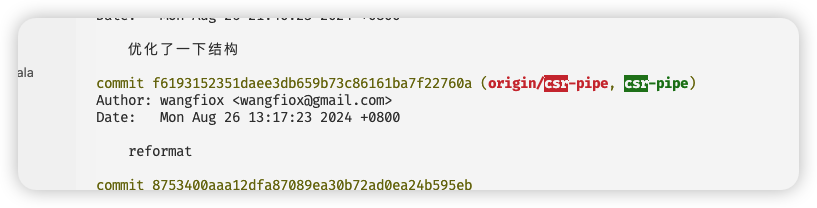
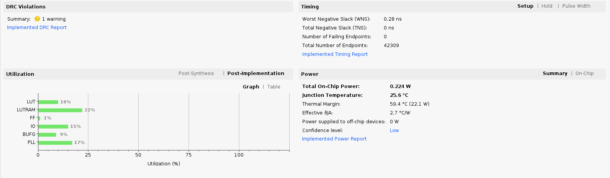
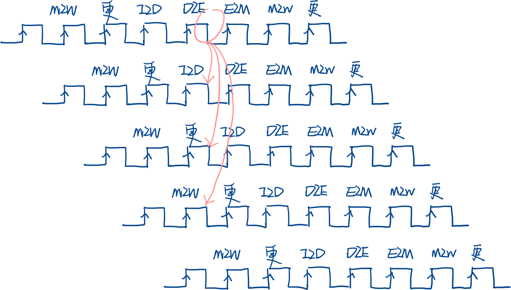

# README - 这个就是实验报告

## 设计概述

### 所有实现的指令

我实现了 37 条常见的 rv32 的指令，如下

```scala
val SW = BitPat("b?????????????????010?????0100011")
val SB = BitPat("b?????????????????000?????0100011")
val SH = BitPat("b?????????????????001?????0100011")
val ADD = BitPat("b0000000??????????000?????0110011")
val SUB = BitPat("b0100000??????????000?????0110011")
val AND = BitPat("b0000000??????????111?????0110011")
val OR = BitPat("b0000000??????????110?????0110011")
val XOR = BitPat("b0000000??????????100?????0110011")
val SLL = BitPat("b0000000??????????001?????0110011")
val SRL = BitPat("b0000000??????????101?????0110011")
val SRA = BitPat("b0100000??????????101?????0110011")
val SLT = BitPat("b0000000??????????010?????0110011")
val SLTU = BitPat("b0000000??????????011?????0110011")
val LB = BitPat("b?????????????????000?????0000011")
val LH = BitPat("b?????????????????001?????0000011")
val LW = BitPat("b?????????????????010?????0000011")
val LBU = BitPat("b?????????????????100?????0000011")
val LHU = BitPat("b?????????????????101?????0000011")
val ADDI = BitPat("b?????????????????000?????0010011")
val ANDI = BitPat("b?????????????????111?????0010011")
val ORI = BitPat("b?????????????????110?????0010011")
val XORI = BitPat("b?????????????????100?????0010011")
val SLLI = BitPat("b000000???????????001?????0010011")
val SRLI = BitPat("b000000???????????101?????0010011")
val SRAI = BitPat("b010000???????????101?????0010011")
val SLTI = BitPat("b?????????????????010?????0010011")
val SLTIU = BitPat("b?????????????????011?????0010011")
val JALR = BitPat("b?????????????????000?????1100111")
val BEQ = BitPat("b?????????????????000?????1100011") // ==
val BNE = BitPat("b?????????????????001?????1100011") // !=
val BLT = BitPat("b?????????????????100?????1100011") // <
val BGE = BitPat("b?????????????????101?????1100011") // >=
val BLTU = BitPat("b?????????????????110?????1100011") // < u
val BGEU = BitPat("b?????????????????111?????1100011") // >= u
val LUI = BitPat("b?????????????????????????0110111")
val AUIPC = BitPat("b?????????????????????????0010111")
val JAL = BitPat("b?????????????????????????1101111")
```

如果看我的 git commit 记录，可以看到: 我曾实现过 6 条 csr 指令，但是发现: 这 6 条 csr 会与 ecall/中断等发生数据冒险,
分析比较复杂, 于是乎 git reset 到了没有 csr 的版本。



### 流水线 CPU 频率

我用 chisel 写的 CPU, 我发现我的 PLL 只能设置到 65MHz, 频率不算高

## 设计的主要特色

1. (设计方面) 使用了新时代的 RTL 级语言: chisel
2. (测试方面) 自己用 rust 实现了一个模拟器，支持 ecall, eret, csr -> 请移步到 rvemu-hitsz 下
3. (测试方面) scala 下仅对 CPUCore 进行验证，外设/dram/irom 均用 scala 语言软件实现 -> 请看 src/test/scala/hitsz
4. rv32 汇编: 在 C 中使用 inline asm 封装对外设的访问，逻辑均使用 C 编写。并用链接器脚本设置 sp 为 dram 的最高地址 -> 请看 Makefile
5. (环境管理) 使用 nix 管理该项目的开发环境 -> 请看 flake.nix

## 流水线 CPU 资源使用



## 流水线 CPU 设计与实现

### valid 令牌

先明确一个概念：物理状态 和 ISA 状态，ISA 状态就是对外状态，对外的状态有几个方面：PC, memory, 寄存器堆, csr。
作废一条指令就是：他的对外状态不会因为这条指令改变，也就是说，我要禁用对这几个状态的写入，于是我引入了一个 valid 令牌，
这个 valid 令牌会顺着流水线流动。

什么情况下会 invalid 呢？

1. 数据冒险: 当发现 exe 阶段的指令是 load, 并且 exe.def == id.use, 将 id 阶段的这条指令置为 valid=0, 并让这个 valid 令牌随着流水线向下流
2. 控制冒险: br, 我采用了静态分支预测: 默认不跳转(因为最简单), exe 阶段会看是否跳转, 如果确实会跳转: 作废接下来的两条指令, 并把 npc 设置为 branch 指向的位置
3. 控制冒险: 直接跳转, 我会作废接下来的一条指令, 并将 npc 设置为 jmp 指向的位置

### IF

```scala
class IF extends Module with HasCoreParameter with HasECALLParameter {
  val io = IO(new Bundle {
    val irom = Flipped(new InstROMBundle)
    val out  = new IF2IDBundle // 取指令输出, pc4 输出
    val jmp = Flipped(new JMPBundle)
    val br  = Flipped(new BRU2IFBundle)
    val ld_hazard = new Bundle {
      val happened = Input(Bool())
      val valid    = Input(Bool())
      val pc       = Input(UInt(XLEN.W))
    }
  })
  /* ---------- pc_cur ---------- */
  private val pc = RegInit(UInt(XLEN.W), 0.U) // pc = 0
  io.irom.addr := pc
  io.out.inst := io.irom.inst
  io.out.pc := pc
  io.out.valid := true.B // 默认是 true
  when(io.jmp.op =/= JMPOpType.jmp_X && io.jmp.valid) {
    io.out.valid := false.B
    io.out.inst  := NOP.U
  }
  when(io.br.br_flag && io.br.valid) {
    io.out.valid := false.B
    io.out.inst  := NOP.U
  }
  when(io.ld_hazard.happened && io.ld_hazard.valid) {
    io.out.valid := true.B
    io.irom.addr := io.ld_hazard.pc
    io.out.pc    := io.ld_hazard.pc
  }
  val npc = MuxCase(
    pc + 4.U,
    Seq(
      // 控制冒险
      (io.br.br_flag && io.br.valid, io.br.pc + io.br.imm),
      (io.jmp.op === JMPOpType.jmp_JAL && io.jmp.valid, io.jmp.pc + io.jmp.imm),
      (io.jmp.op === JMPOpType.jmp_JALR && io.jmp.valid, (io.jmp.rs1_v + io.jmp.imm) & ~1.U(XLEN.W)),
      (io.jmp.op === JMPOpType.jmp_ECALL && io.jmp.valid, ECALL_ADDRESS.U),
      // TODO ERET
      // 数据冒险
      (io.ld_hazard.happened && io.ld_hazard.valid, pc)
    )
  )
  pc := npc
}
```

控制冒险会有几种: 非条件跳转、条件跳转。非条件跳转在译码阶段就可以识别。条件跳转在执行阶段得到结果。



## 设计过程中遇到的问题及解决方法

### 有问题的外设

遇到的问题: 大二上学期没有写好的数码管最终还是背刺了我，呜呜~ 。 我用 chisel 重写了一遍，但是逻辑没变。
解决方案：最终没有解决（，勉强能用。

### 编译出不支持的指令

我其实将 C 编译成 asm 的时候，是战战兢兢的，因为我总是担心他会编译出来无效的指令，比方说压缩指令。然后我查手册，知道了要加上 mabi, march 之类的。
（但是我依然无法保证他不会生成不支持的指令，我的评价是：可以重写一个仅支持 37 条指令的编译器后端）

### 链接脚本

就是一个程序是需要用到栈的，但是比较难绷的就是：我默认编译出来的程序是对的，然后我没有在程序中初始化 sp 。
我上板子观察不到现象（我当时比较自信，觉得我 difftest 都过了，应该没啥问题。最后没啥思路，将我的 random.bin 放到 difftest 中，
出现了数组越界的提示，我才意识到：sp 没有初始化。

同时还有另一个问题：我的 main, 他的起始地址不一定是 0

有一种很丑的方案：我每次编译出 .s, 将 main 放到开头, 再在 main 前面加上 `li sp, 65536`。但是这样太丑了，太丑了

重复了一两次之后，我想到了链接器脚本。于是乎我去查资料, 得到了 Makefile 中描述的解决方案

### difftest 提供的测试样例检测不出的问题

问题描述：

```asm
lw a0, 0(<base>)
jalr ra, a0, <offset>
```

可以看到：这里发生了数据冒险，而且这里即使 a0 forward 也有问题，需要插入一条气泡。

```asm
lw a0, 0(<base>)
<bubble>
jalr ra, a0, <offset>
```

事实上，我确实插入了气泡，但是我忘记作废以及到 id 阶段的 jalr 了。jalr 会在 id 阶段引出一条线束给 IF, 结果 IF 识别到了这个 jalr,
最终跳转到了错误的位置，导致处理器卡死了，呜呜。

这是我设计上曾经疏漏的地方： 但是我忘了一个地方，就是还会逆着流水线流动：跳转指令，然后我忘记逆流而上的线中添加 valid 字段了，导致出现了问题。

我的评价是：找 bug 半天，改 bug 几分钟（

## 总结

### 想法 1

我觉得是可以教学弟学妹们使用 gcc 的，这里指的是 汇编器，可能像我一样用 C 语言写比较犯规。
gcc 将 .s 转为 .elf, 再用 objcopy 将 .elf 转为 .bin, 再用 python 脚本将 .bin 转换为 .coe 。
rars 不好的地方: .data 和 .text 完全分开。但是会有问题: C 语言的 switch 会被转换成 函数指针向量，
有点类似于 8086 的中断向量，这个向量理应放在.data 段，毕竟是数据，只不过数据是 .text 中的地址，
我觉得这种方式在: .text 与.data 分开的情况下没法表达。

事实上：.text 与 .data 其实最后都是放在一起的，变为 image, mmap, 装载之类的。
包括我们学校提供的模拟器，也做了一个操作：将 image 在 irom 和 dram 中同时拷贝了一份

我可以写相关文档，放到 osa 或者课程设计里之类的

### 想法 2

我了解到没有同学实现了例外之类的，或许是因为我们的模拟器也不支持。
目前我写的模拟器支持例外（但是不能支持中断，如果支持中断，我可以开一个线程监听键盘之类的，但是我觉得这没法做 difftest）

### 想法 3

或许可以使用模糊测试 (libfuzz) 生成汇编

### 总结 1

个人部分认同语言无用论，但是较为优雅的语言令人身心愉悦，能写出怎么样的处理器取决于对体系结构的认识
